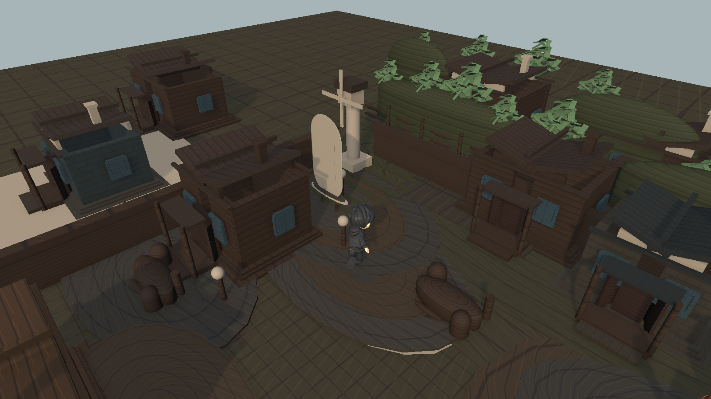
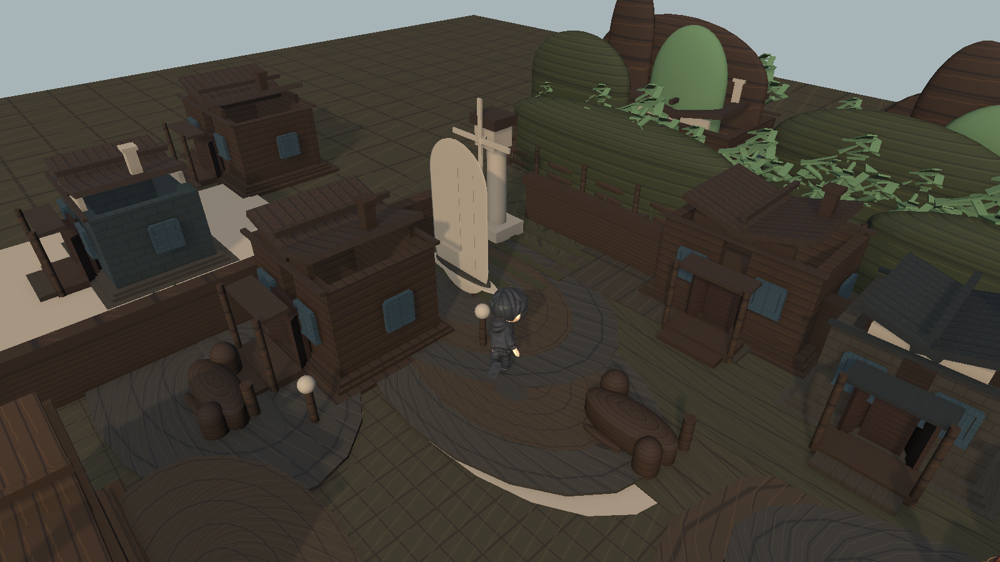
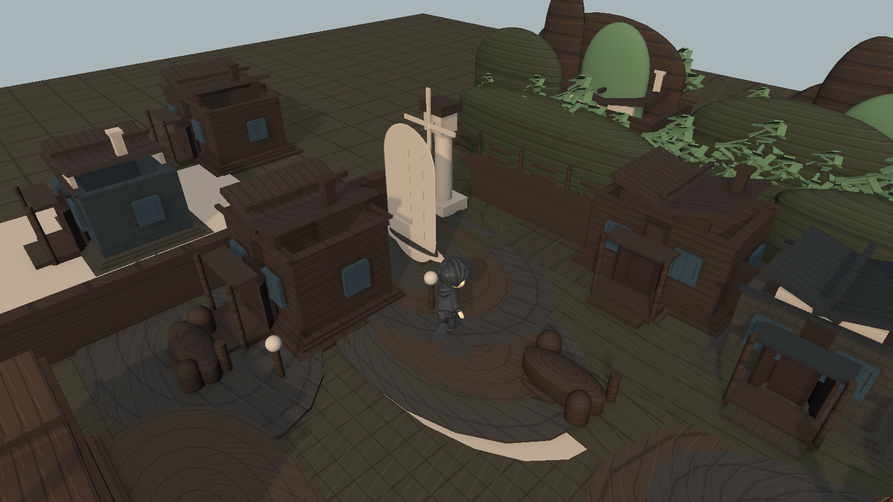

# First Screen Visual Review

- Baseline commit: `6dfd4ee`
- Best screenshot: `pass-a-local-visual-notice-player-a.png`

## Baseline

## Pass A

Summary:
- Notice board silhouette and backing were strengthened.
- Player start area got more local contrast and contact grounding.
- North/background blockers reduced some of the empty test-map feel.

## Pass B

Summary:
- Visible building roof/wall/base separation was adjusted.
- Window and trim contrast were nudged upward.
- Screenshot difference was present but weaker than Pass A.

## Honest Assessment

Pass A is the clearest improvement. The notice board reads better and the top background feels less empty.

Pass B underperformed. Buildings are slightly easier to parse, but the first screen still looks prototype-heavy and the brown mass problem is not solved strongly enough.

The scene is more readable than the baseline, but it still does not look like a finished opening screen.

## Next Recommended Task

Do a focused building-mass and landmark-composition pass only:

- make first-screen buildings read clearly as roof / wall / base at a glance
- preserve the improved notice-board silhouette from Pass A
- avoid touching terrain generation again
- validate with one more `EditorRender` screenshot through the local auto loop
